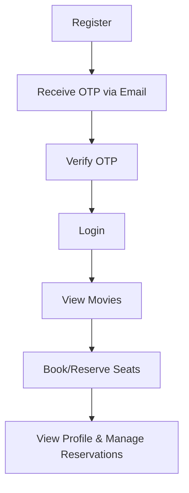

# Boovie
Build backend system for a movie reservation service. The service will allow users to sign up, log in, browse movies, reserve seats for specific showtimes, and manage their reservations. The system will feature user authentication, movie and showtime management, seat reservation functionality, and reporting on reservations.
The goal is to simulate a **real-world cinema booking system**, focusing on clean architecture, role-based access control, and secure business logic.

---

## 🧰 Tech Stack

| Layer           | Technology                                               |
| --------------- | -------------------------------------------------------- |
| **Backend**     | Django 5.x, Python 3.12                                  |
| **Database**    | SQLite (PostgreSQL ready)                                |
| **Frontend**    | Django Templates + Bootstrap 5                           |
| **Auth**        | Custom User Model (email-based login + OTP verification) |
| **Mail**        | Django Email Backend                                     |
| **Environment** | `.env` + Configurable SMTP                               |

---

<details>
<summary><h2>✅ Features Implemented So Far</h2></summary>

### 🔐 **Authentication & Authorization**

* Custom User Model using **email as username**
* **Role-based access** (Admin / Regular User)
* **Email OTP verification** on signup
* **OTP features:**

  * Expiry after configurable duration
  * Resend option
  * Rate limiting (in progress)
* **Login system:**

  * “Remember Me” option
  * Account lock after repeated failed logins
  * Redirect authenticated users away from login page
* **Logout** and **Profile** view
* **Forgot Password** — only for verified, manually registered users

---

### 📩 **OTP Verification Workflow**

* OTP sent via email after registration
* OTP expires after X minutes
* Resend functionality with rate limiting
* Invalid OTPs displayed via Bootstrap alerts

---

### 🎥 **Movie Management (Phase 1)**

* Admin can create, edit, and delete movies
* Movie model includes:

  * Title
  * Description
  * Poster image
  * Genre
* Movies displayed on a Bootstrap card grid with “View Showtimes” button

---

### 🎨 **User Interface**

All pages extend a shared `base.html` template for consistent styling:

| Template               | Description                          |
| ---------------------- | ------------------------------------ |
| `base.html`            | Global Bootstrap layout with navbar  |
| `login.html`           | Styled login form with “Remember Me” |
| `register.html`        | Email-based signup form              |
| `verify_otp.html`      | OTP verification with resend option  |
| `forgot_password.html` | Secure reset for verified users      |
| `profile.html`         | User info & logout                   |
| `home.html`            | Movie grid display                   |

---

### 📬 **Email System**

Configured for SMTP with environment variables:

```bash
EMAIL_HOST=smtp.gmail.com
EMAIL_PORT=587
EMAIL_USE_TLS=True
EMAIL_HOST_USER=youremail@gmail.com
EMAIL_HOST_PASSWORD=yourpassword
```

</details>

---

<details>
<summary><h2>🧩 Project Structure</h2></summary>

```
Boovie/
├── accounts/
│   ├── models.py              
│   ├── views.py          
│   ├── forms.py 
│   ├── urls.py
│   └── templates/
│       ├── base.html
│       ├── login.html
│       ├── register.html
│       ├── verify_otp.html
│       ├── forgot_password.html
│       ├── profile.html
│       └── home.html
├── movies/
│   ├── models.py              # Movie, Showtime models
│   ├── views.py               # Home page + movie listings
│   └── urls.py
└── manage.py
```

</details>

---

## 🧠 Core User Flow



---

## ⚙️ Setup & Installation

```bash
# 1️⃣ Clone repository
git clone git@github.com:john-otienoh/Boovie.git
cd Boovie

# 2️⃣ Create and activate virtual environment
python -m venv .venv
source .venv/bin/activate  # or .venv\Scripts\activate on Windows

# 3️⃣ Install dependencies
pip install -r requirements.txt

# 4️⃣ Apply migrations
python manage.py migrate

# 5️⃣ Create superuser
python manage.py createsuperuser

# 6️⃣ Run development server
python manage.py runserver
```

Then open 👉 **[http://127.0.0.1:8000/](http://127.0.0.1:8000/)**

---

## 📋 Remaining Checklist (Next Milestones)

### 🧩 Authentication & Security

* [ ] Implement OTP resend rate-limiting
* [ ] Add throttling for failed login attempts
* [ ] Add password reset confirmation page (styled)
* [ ] Optionally integrate 2FA

### 🎬 Movie & Showtime Management

* [ ] Build CRUD for movies and showtimes (admin)
* [ ] Add genre filters and search
* [ ] Handle overlapping showtime scheduling

### 🎟️ Reservation System

* [ ] Create Reservation, Seat, and Showtime models
* [ ] Implement seat selection + locking
* [ ] Prevent overbooking using DB transactions
* [ ] Add cancellation logic (for upcoming shows only)

### 📊 Reporting

* [ ] Admin dashboard with charts (capacity, revenue, trends)
* [ ] Integrate Chart.js for data visualization

### 💌 Notifications

* [ ] Send booking confirmation and reminders
* [ ] Add cancellation email alerts

### 🌐 UI/UX

* [ ] Build responsive showtime and seat selection pages
* [ ] Add success and confirmation modals
* [ ] Improve form validation messages

### 🚀 Deployment

* [ ] Configure for PostgreSQL
* [ ] Add production settings & `.env`
* [ ] Deploy on Render / Railway / DigitalOcean

---

## 🧑‍💻 Author

**John Otienoh**
💼 Django Backend Developer
📧 [your.email@example.com](mailto:otienohjohncharles@gmail.com)
🌍 [GitHub](https://github.com/john-otienoh)

